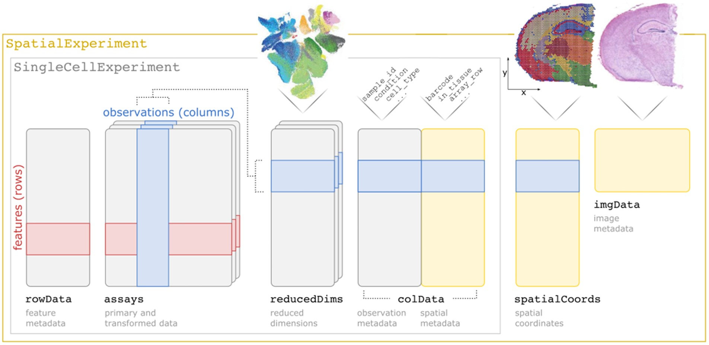

# Practical session 1

In this practical session you will familiarise yourself with some example spatial transcriptomics (STx) data and the common features of such data.

## About this documentation

This handbook is designed to walk you through the practical elements of today's tutorial. All of the code you need to accomplish the basic tasks thoughout the day is presented in full, there are some 'stretch goals' in some of the tutorials where only a template is provided. This is not a typing tutorial, so feel free to copy and paste where necessary. The tutorials are written in `rmarkdown` and presented on [bookdown.org](https://bookdown.org/).

## Posit Cloud

You should have received an invite to the [Posit Cloud](https://posit.cloud/) Space for today's tutorial. Accepting this invite will give you access to the 4 RStudio projects for the 4 sessions we will run today. Each project has the required packages pre-installed, and the data files uploaded. These projects are set up as "Assignments" so that you get your own copy of the workspace. 

## Import 10X Visium data

In this tutorial we will be using data from the [STexampleData](https://bioconductor.org/packages/STexampleData) package that contains a small collection of STx datasets from different technologies, including SlideSeq V2, seqFISH and 10x Genomics Visium. These datasets are provided in the `SpatialExperiment` format - described below.

The specific dataset used for this tutorial is a single sample from the dorsolateral prefrontal cortex (DLPFC) - a 10x Genomics Visium dataset that was published by @Maynard2021Mar.

Here, we show how to load the data from the `STexampleData` package.

```{r 01_load-data, message=FALSE}
library(SpatialExperiment)
library(STexampleData)
library(ggplot2)
library(ggspavis)

# Load the object
spe <- Visium_humanDLPFC()
```

## Explore data types

There is a long history of encapsulating expression data in S3 and S4 objects in R, going back to the `ExpressionSet` class in Biobase which was designed to store a matrix of microarray data alongside associated experimental metadata. This concept of storing all the relevant data and metadata in a single object has persisted through the development of RNA-Seq analysis (e.g. `SummarizedExperiment`) and into the age of single-cell transcriptomics (e.g. `SingleCellExperiment` - see below).

### SpatialExperiment class

For the first part of this tutorial (practical sessions 1 and 2), we will be using the  [SpatialExperiment](https://bioconductor.org/packages/SpatialExperiment) S4 class from Bioconductor as the main data structure for storing and manipulating datasets.

`SpatialExperiment` is a specialized object class that supports the storing of spatially-resolved transcriptomics datasets within the Bioconductor framework. It builds on the [SingleCellExperiment](https://bioconductor.org/packages/SingleCellExperiment) class [@Amezquita2020Feb] for single-cell RNA sequencing data, which itself extends the `RangedSummarizedExperiment` class. More specifically, `SpatialExperiment` has extra customisations to store spatial information (i.e., spatial coordinates and images).

An overview of the `SpatialExperiment` object structure is is presented in \@ref(fig:SpExp-overview). In brief, the `SpatialExperiment` object consists of the below five parts:  

 1. `assays`: gene expression counts  
 2. `rowData`: information about features, usually genes  
 3. `colData`: information on spots (non-spatial and spatial metadata)  
 4. `spatialCoords`: spatial coordinates  
 5. `imgData`: image data 

**NOTE:** For spot-based STx data (i.e., 10x Genomics Visium), a single `assay` named `counts` is used.

```{r SpExp-overview, echo=FALSE, out.width = "100%", fig.align="center", fig.cap="Overview of the `SpatialExperiment` object class structure."}

```

For more details, see the related publication from Righelli et al., 2021 describing the `SpatialExperiment` [@Righelli2022Jun].

### Inspect the object

```{r 01_data-inspect, message=FALSE}
## Check the object's structure
spe

## Check number of features/genes (rows) and spots (columns)
dim(spe)

## Check names of 'assay' tables
assayNames(spe)
```

### Counts table and gene metadata

```{r 01_counts-inspect, message=FALSE}
## Have a look at the counts table
assay(spe)[1:6,1:4]
```

As we can see here the counts table is an object of class `dgTMatrix` which is a sparse matrix. This is because much like scRNA-seq data, STx data include many zeros. As a result, to make the counts table as light as possible we resort to using sparse matrices. This next code chunk examines a part of the matrix that includes genes with some level of expression:

```{r 01_counts-chunks, message=FALSE}
assay(spe)[20:40, 2000:2010]

assay(spe)[33488:33508, 2000:2010]
```

The levels of expression of different genes in the same spots differ significantly with many low values being present. We have to remember here that this data is not as yet normalized, and is therefore affected by systematic factors such as library size. Nonetheless, what is demonstrated here is typical for STx data (as it is for scRNA-seq data) - many genes will show low expression in individual spots.

To continue our exploration of the information stored in the `SpatialExperiment` object:

```{r 01_gene-metaData, message=FALSE}
## Have a look at the genes metadata
head(rowData(spe))
```

### Coordinates table and spot metadata

The data that distinguished a `SpatialExperiment` object is the coordinate data which describes the spatial location of each spot.

```{r 01_coordinates-inspect, message=FALSE}
## Check the spatial coordinates
head(spatialCoords(spe))

## spot-level metadata
head(colData(spe))

```

### Image metadata

Finally, the `SpatialExperiment` object also contains the image data from the STx experiment, giving the coordinates we looked at in the previous section some context in terms of the tissue of origin.


```{r 01_image-inspect, message=FALSE}
## Have a look at the image metadata
imgData(spe)
```

As well as this (fairly basic) metadata, the `spe` object also contains the image itself, which the `SpatialExperiment` class allows us to access, like so:

```{r 01_plot-image, message=FALSE, fig.height=8, fig.width=8}
## retrieve the image
spi <- getImg(spe)
## "plot" the image
plot(imgRaster(spi))
```

We can also use the scaling factors in the `imgData` to plot the locations of the Visium spots over the image. The position of a point in an image does not map directly to the spot location in cartesian coordinates, as it is the top-left of an image that is (0,0), not the bottom-left. In order to manage this, we need to transform the y-axis coordinates.

```{r 01_plot-spots, message=FALSE, fig.height=8, fig.width=8}
## "Plot" the image
plot(imgRaster(spi))
## Extract the spot locations
spot_coords <- spatialCoords(spe) %>% as.data.frame
## Scale by low-res factor
lowres_scale <- imgData(spe)[imgData(spe)$image_id == 'lowres', 'scaleFactor']
spot_coords$x_axis <- spot_coords$pxl_col_in_fullres * lowres_scale
spot_coords$y_axis <- spot_coords$pxl_row_in_fullres * lowres_scale
## lowres image is 600x600 pixels
dim(imgRaster(spi))
## flip the Y axis
spot_coords$y_axis <- abs(spot_coords$y_axis - (ncol(imgRaster(spi)) + 1))
points(x=spot_coords$x_axis, y=spot_coords$y_axis)
```

An equivalent plot, using `ggplot2` as the plotting library:

```{r 01_ggplot-spots, message=FALSE, fig.height=8, fig.width=8}
ggplot(mapping = aes(1:600, 1:600)) +
  annotation_raster(imgRaster(spi), xmin = 1, xmax = 600, ymin = 1, ymax = 600) +
  geom_point(data=spot_coords, aes(x=x_axis, y=y_axis), alpha=0.2) + xlim(1, 600) + ylim(1, 600) +
  coord_fixed() + 
  theme_void()
```
We can also extract additional metadata to make these plots more informative - for instance, the annotation from `colData` that flags whether a spot is "on tissue" or not can be used to colour the spots like so:


```{r 01_ggplot_ontissue, message=FALSE, fig.height=8, fig.width=8}
## Add the annotation to the coordinate data frame
spot_coords$on_tissue <- as.logical(colData(spe)$in_tissue)

ggplot(mapping = aes(1:600, 1:600)) +
  annotation_raster(imgRaster(spi), xmin = 1, xmax = 600, ymin = 1, ymax = 600) +
  geom_point(data=spot_coords, aes(x=x_axis, y=y_axis, colour=on_tissue), alpha=0.2) + xlim(1, 600) + ylim(1, 600) +
  coord_fixed() + 
  theme_void()
```

Having to manually extract the relevant information from the `SpatialExperiment` object to generate plots like this does not generally make sense, and defies the point of using a data class that can encapsulate this information. We can instead use a package like `ggspavis`, which is explicitly built for generating visualisations of STx data directly from the `SpatialExperiment` object. We will make extensive use of this package during the next tutorial as we work through quality control processes for STx data. The pre-built nature of these plots is convenient, though it prevents users from achieving tasks like adding the tissue image to the plot. For many users the convenience will outweigh any issues this presents, though it is worth being aware of how to build visualisations from the ground up.

```{r 01_ggspavis-ontissue, message=FALSE, fig.height=8, fig.width=8}
plotSpots(spe, in_tissue = NULL, annotate='in_tissue', size=0.5)
```

## Conclusion

This first practical session has been a pretty straight-forward examination of an example Visium dataset. We've demonstrated where in this object the data and metadata are stored, how to extract it and make simple use of it.


