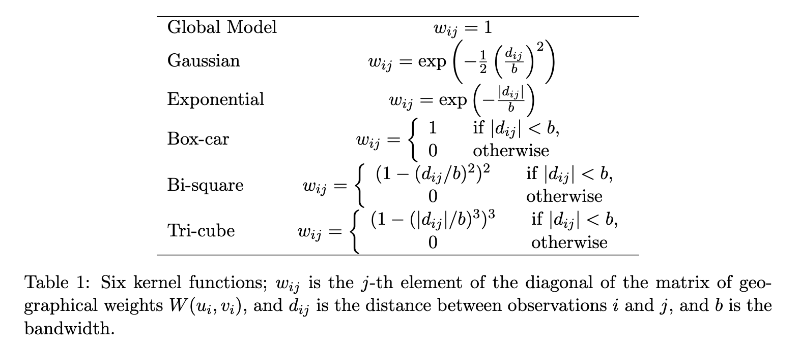

# Practical session 3

This practical session will demonstrate the application of the most commonly used spatial analysis tools to STx data, and how we work with coordinate data alongside expression data. 


## Load packages

```{r 03_loadPackages, eval=TRUE}
library(SpatialFeatureExperiment)
library(tidyverse)
library(scran)
library(scater)
library(ggspavis)
library(sf)
library(spdep)
library(GWmodel)
library(tidyterra)
# STExplorer is our own, under-development package for STx analysis
library(STExplorerDev)
```

-   [`spdep`](https://cran.r-project.org/web/packages/spdep/index.html) is a collection of functions to create spatial weights matrix objects from polygon *contiguities*, from point patterns by distance and tessellations. It is used for summarizing these objects, and for permitting their use in spatial data analysis like regional aggregation and tests for spatial *autocorrelation*.

-   [`sf`](https://cran.r-project.org/web/packages/sf/index.html) (*Simple Features for R*) is a package that offers support for simple features, a standardized way to encode spatial vector data.

-   [`GWmodel`](https://cran.r-project.org/web/packages/GWmodel/index.html) is a suite of models that fit situations when data are not described well by some global model, but where there are spatial regions where a suitably localised calibration provides a better description.

## Background

### Main geocomputational data structures

There are three main data structures that we need to have ready before we undertake a geocomputational approach to STx data analysis. Namely these are; (1) geometries (point and polygon), (2) neighbours lists and (3) distance matrices.

1.  Spatial geometries can be points, lines, polygons and pixels. Polygons consist of a multitude of points connected by lines and can have many forms like circle, hexagon, non-canonical polygon etc.

2.  Neighbour lists are special types of lists that contain information about the neighbours of each polygon. The neighbours can be defined either by adjacency or by distance.

3.  Distance matrices contain the distances between different points and can be either weighted or un-weighted. The weighted distances are usually objective to each point and its neighbours. Meaning that the closer or farther a neighbour is from the point of focus, the weight of their distance changes according to an applied kernel. Usually in the case of STx data, like the ones generated by the 10X Visium platform, the un-weighted distance between two points is expressed in pixels and we acquire it from the `spaceranger` output.

### The `sf` objects

Package `sf` represents simple features as native R objects. All functions and methods in `sf` that operate on spatial data are prefixed by *st\_*, which refers to *spatial type*. Simple features are implemented as R native data, using simple data structures (S3 classes, lists, matrix, vector). The typical use of `sf` involves reading, manipulating and writing of sets of features, with attributes and geometries.

As attributes are typically stored in `data.frame` objects (or the very similar `tbl_df`), we will also store feature geometries in a `data.frame` column. Since geometries are not single-valued, they are put in a list-column, a list of length equal to the number of records in the `data.frame`, with each list element holding the simple feature geometry of that feature. The three classes used to represent simple features are:

-   `sf`, the table (`data.frame`) with feature attributes and feature geometries, which contains
-   `sfc`, the list-column with the geometries for each feature (record), which is composed of
-   `sfg`, the feature geometry of an individual simple feature.

#### Simple feature geometry types

The following seven simple feature types are the most common:

| type                 | description                                                                                                                                                                                                               |
|----------------------|---------------------------------------------------------------------------------------------------------------------------------------------------------------------------------------------------------------------------|
| `POINT`              | zero-dimensional geometry containing a single point                                                                                                                                                                       |
| `LINESTRING`         | sequence of points connected by straight, non-self intersecting line pieces; one-dimensional geometry                                                                                                                     |
| `POLYGON`            | geometry with a positive area (two-dimensional); sequence of points form a closed, non-self intersecting ring; the first ring denotes the exterior ring, zero or more subsequent rings denote holes in this exterior ring |
| `MULTIPOINT`         | set of points; a MULTIPOINT is simple if no two Points in the MULTIPOINT are equal                                                                                                                                        |
| `MULTILINESTRING`    | set of linestrings                                                                                                                                                                                                        |
| `MULTIPOLYGON`       | set of polygons                                                                                                                                                                                                           |
| `GEOMETRYCOLLECTION` | set of geometries of any type except GEOMETRYCOLLECTION                                                                                                                                                                   |

Each of the geometry types can also be a (typed) empty set, containing zero coordinates (for `POINT` the standard is not clear how to represent the empty geometry). Empty geometries can be thought of as being the analogue to missing (`NA`) attributes, NULL values or empty lists.

#### sf: objects with simple features

As we usually do not work with geometries of single `simple features`, but with datasets consisting of sets of features with attributes, the two are put together in `sf` (simple feature) objects. The following command reads a test dataset called `nc` from a file that is contained in the `sf` package:

```{r 03_sf_LoadTest}
nc <- st_read(system.file("shape/nc.shp", package = "sf"))
```

The short report printed gives the file name, the driver (ESRI Shapefile), mentions that there are 100 features (records, represented as rows) and 14 fields (attributes, represented as columns).

This object is of class:

```{r 03_sf_TestClass}
class(nc)
```

meaning it extends (and "is" a) `data.frame`, but with a single list-column with geometries, which is held in the column with name:

```{r 03_sf_Test_sf_column}
attr(nc, "sf_column")
```

If we print the first three features, we see their attribute values and an abridged version of the geometry

```{r 03_sf_Test_print, echo=TRUE, eval=FALSE}
print(nc[9:15], n = 3)
```

which would give the following output:

```{r Sf-overview, echo=FALSE, out.width = "100%", fig.align="center", fig.cap="Overview of the `sf` object."}
knitr::include_graphics("images/sf_xfig.png")
```

In the output we see:

-   in green a simple feature: a single record, or `data.frame` row, consisting of attributes and geometry
-   in blue a single simple feature geometry (an object of class `sfg`)
-   in red a simple feature list-column (an object of class `sfc`, which is a column in the `data.frame`)
-   that although geometries are native R objects, they are printed as [well-known text](#wkb)

It is also possible to create `data.frame` objects with geometry list-columns that are not of class `sf`, e.g. by:

```{r 03_sf_no.sf}
nc.no_sf <- as.data.frame(nc)
class(nc.no_sf)
```

However, such objects:

-   no longer register which column is the geometry list-column
-   no longer have a plot method, and
-   lack all of the other dedicated methods for class `sf`

#### sfc: simple feature geometry list-column

The column in the `sf` data.frame that contains the geometries is a list, of class `sfc`. We can retrieve the geometry list-column in this case by using standard `data.frame` notation like `nc$geom` or `nc[[15]]`, but the more general way uses `st_geometry`:

```{r 03_sfc_Test1}
(nc_geom <- st_geometry(nc))
```

Geometries are printed in abbreviated form, but we can view a complete geometry by selecting it, e.g. the first one by:

```{r 03_sfc_Test2}
nc_geom[[1]]
```

The way this is printed is called *well-known text*, and is part of the standards. The word `MULTIPOLYGON` is followed by three parentheses, because it can consist of multiple polygons, in the form of `MULTIPOLYGON(POL1,POL2)`, where `POL1` might consist of an exterior ring and zero or more interior rings, as of `(EXT1,HOLE1,HOLE2)`. Sets of coordinates are held together with parentheses, so we get `((crds_ext)(crds_hole1)(crds_hole2))` where `crds_` is a comma-separated set of coordinates of a ring. This leads to the case above, where `MULTIPOLYGON(((crds_ext)))` refers to the exterior ring (1), without holes (2), of the first polygon (3) - hence three parentheses.

We can see there is a single polygon with no rings:

```{r 03_sfc_Test3, fig.height=3}
par(mar = c(0,0,1,0))
plot(nc[1], reset = FALSE) # reset = FALSE: we want to add to a plot with a legend
plot(nc[1,1], col = 'grey', add = TRUE)
```

Following the `MULTIPOLYGON` data structure, in R we have a list of lists of lists of matrices. For instance, we get the first 3 coordinate pairs of the second exterior ring (first ring is always exterior) for the geometry of feature 4 by:

```{r 03_sfc_Test4}
nc_geom[[4]][[2]][[1]][1:3,]
```

Geometry columns have their own class,

```{r 03_sfc_Test5}
class(nc_geom)
```

#### sfg: simple feature geometry

Simple feature geometry (`sfg`) objects carry the geometry for a single feature, e.g. a point, linestring or polygon.

Simple feature geometries are implemented as R native data, using the following rules

1.  a single POINT is a numeric vector
2.  a set of points, e.g. in a LINESTRING or ring of a POLYGON is a `matrix`, each row containing a point
3.  any other set is a `list`

```{r 03_sf_Test6, echo=FALSE, eval=TRUE, message=FALSE}
p <- rbind(c(3.2,4), c(3,4.6), c(3.8,4.4), c(3.5,3.8), c(3.4,3.6), c(3.9,4.5))
(mp <- st_multipoint(p))
s1 <- rbind(c(0,3),c(0,4),c(1,5),c(2,5))
(ls <- st_linestring(s1))
s2 <- rbind(c(0.2,3), c(0.2,4), c(1,4.8), c(2,4.8))
s3 <- rbind(c(0,4.4), c(0.6,5))
(mls <- st_multilinestring(list(s1,s2,s3)))
p1 <- rbind(c(0,0), c(1,0), c(3,2), c(2,4), c(1,4), c(0,0))
p2 <- rbind(c(1,1), c(1,2), c(2,2), c(1,1))
pol <-st_polygon(list(p1,p2))
p3 <- rbind(c(3,0), c(4,0), c(4,1), c(3,1), c(3,0))
p4 <- rbind(c(3.3,0.3), c(3.8,0.3), c(3.8,0.8), c(3.3,0.8), c(3.3,0.3))[5:1,]
p5 <- rbind(c(3,3), c(4,2), c(4,3), c(3,3))
(mpol <- st_multipolygon(list(list(p1,p2), list(p3,p4), list(p5))))
(gc <- st_geometrycollection(list(mp, mpol, ls)))
```

The below figure illustrates the different types of geometries:

```{r 03_sf_Test7, echo=FALSE, eval=TRUE}
par(mar = c(0.1, 0.1, 1.3, 0.1), mfrow = c(2, 3))
plot(mp, col = 'red')
box()
title("MULTIPOINT")
plot(ls, col = 'red')
box()
title("LINESTRING")
plot(mls, col = 'red')
box()
title("MULTILINESTRING")
plot(pol, border = 'red', col = 'grey', xlim = c(0,4))
box()
title("POLYGON")
plot(mpol, border = 'red', col = 'grey')
box()
title("MULTIPOLYGON")
plot(gc, border = 'grey', col = 'grey')
box()
title("GEOMETRYCOLLECTION")
par(mfrow = c(1, 1))
```

Geometries can also be empty, as in

```{r 03_sf_Test8, collapse=TRUE}
(x <- st_geometrycollection())
length(x)
```

*The above are taken from the very well written, well-descriptive and thorough `sf` package [vignette](https://cran.r-project.org/web/packages/sf/vignettes/sf1.html).*

## Data structures preparation

For this practical we will be using a human steatotic kidney dataset from the [Liver Atlas](https://livercellatlas.org/index.php) [@GUILLIAMS2022379]. Specifically we will use the JBO019 sample.

### Load new dataset

**Note** - Between now and section [3.8](##Neighbour graph and distance matrix) nothing new is introduced (this is a repetition of the QC carried out in practical 2, but with this new liver dataset). Feel free to skip over this section and use the [code block](###Code for 3.3 to 3.7) just before section 3.8 to run this QC quickly for this data. 

First we generate the `SpatialFeaturesExperiment` object which is an extension of the `SpatialExperiment` (SPE) object that we used in the 2nd practical session. The difference is that the SFE object has incorporated the `sf` object structure and thus can accommodate the use of geocomputational tools.

```{r 03_load_sfe, warning=FALSE, message=FALSE}
sampleDir <- "./data/spaceranger_outs/Human_Liver_Steatotic/JBO019_Results"
sampleNames <- "JBO019"
sfe <- read10xVisiumSFE(samples = sampleDir, 
                        sample_id = sampleNames, 
                        type = "sparse", 
                        data = "filtered", 
                        images = "lowres", 
                        style = "W", 
                        zero.policy = TRUE)

ground_truth <- read_table("./data/to_load/spotzonationGroup.txt")

```

## Spot-level Quality Control

### Calculating QC metrics

In this section we are effectively recapitlating the spot- and gene-level QC from practical 2 for this new dataset, in order that we can use it for the practical exercises in the next session. 

```{r 03_QC_sfe1, message=FALSE, warning=FALSE}
is_mito <- grepl("(^MT-)|(^mt-)", rowData(sfe)$symbol)
sfe <- addPerLocQC(sfe, gTruth = ground_truth, assay = "counts", 2, subsets = list(mito = is_mito))
sfe <- addGeometries(sfe, samples = sampleDir, sample_id = sampleNames, res = "fullres")
sfe <- addPerGeneQC(sfe, assay = "counts", version = NULL, mirror = NULL)

colData(sfe)
rowData(sfe)
colGeometries(sfe)
```

### Plot manual annotation

```{r 03_QC_sfe2, message=FALSE, warning=FALSE}
ggplot() + 
  geom_sf(aes(geometry = colGeometries(sfe)$spotHex$geometry, fill = colData(sfe)$annotation)) + 
  theme_void() + 
  theme(legend.position = "right") + 
  labs(fill = "Annotation")
```

### Library size threshold

```{r 03_QC_sfe3}
# ----------------------------------------------- #
## Density and histogram of library sizes
ggplot(data = as.data.frame(colData(sfe)),
       aes(x = sum)) +
    geom_histogram(aes(y = after_stat(density)), 
                   colour = "black", 
                   fill = "grey",
                   bins = 50) +
    geom_density(alpha = 0.5,
                 adjust = 0.5,
                 fill = "#A0CBE8",
                 colour = "#4E79A7") +
    geom_vline(xintercept = c(1000, NA),
               colour = "red", 
               linetype = "dashed") + 
    scale_x_continuous(breaks = scales::pretty_breaks(n = 10)) + 
    scale_y_continuous(breaks = scales::pretty_breaks(n = 10)) + 
    xlab("Library size") + 
    ylab("Density") + 
    theme_classic()
## Select library size threshold
qc_lib_size <- colData(sfe)$sum < 1000 #| colData(sfe)$sum > 45000
## Check how many spots are filtered out
table(qc_lib_size)
## Add threshold in colData
colData(sfe)$qc_lib_size <- qc_lib_size
## Check putative spatial patterns of removed spots
ggplot() + 
    geom_sf(data = colGeometry(sfe, "spotHex"),
            aes(geometry = geometry)) + 
    geom_sf(data = colGeometry(sfe, "spotHex"),
            aes(geometry = geometry, fill = colData(sfe)$qc_lib_size)) +
    scale_fill_manual(values = c("grey95", "red")) + 
    labs(fill = "Discarded") + 
    theme_bw()
```

### Number of expressed genes

```{r 03_QC_sfe4}
# ----------------------------------------------- #
## Density and histogram of expressed genes
ggplot(data = as.data.frame(colData(sfe)),
       aes(x = detected)) +
    geom_histogram(aes(y = after_stat(density)), 
                   colour = "black", 
                   fill = "grey",
                   bins = 50) +
    geom_density(alpha = 0.5,
                 adjust = 0.5,
                 fill = "#A0CBE8",
                 colour = "#4E79A7") + 
    geom_vline(xintercept = c(550, NA),
               colour = "red", 
               linetype = "dashed") +
    scale_x_continuous(breaks = scales::pretty_breaks(n = 10)) + 
    scale_y_continuous(breaks = scales::pretty_breaks(n = 10)) + 
    xlab("Genes expressed in each spot") + 
    ylab("Density") + 
    theme_classic()
## Select expressed genes threshold
qc_detected <- colData(sfe)$detected < 550 #| colData(sfe)$detected > 6000
## Check how many spots are filtered out
table(qc_detected)
## Add threshold in colData
colData(sfe)$qc_detected <- qc_detected
## Check for putative spatial pattern of removed spots
ggplot() + 
    geom_sf(data = colGeometry(sfe, "spotHex"),
            aes(geometry = geometry)) + 
    geom_sf(data = colGeometry(sfe, "spotHex"),
            aes(geometry = geometry, fill = colData(sfe)$qc_detected)) +
    scale_fill_manual(values = c("grey95", "red")) + 
    labs(fill = "Discarded") + 
    theme_bw()
```

### Percentage of mitochondrial expression

```{r 03_QC_sfe5}
# ----------------------------------------------- #
## Density and histogram of percentage of mitochondrial expression
ggplot(data = as.data.frame(colData(sfe)),
       aes(x = subsets_mito_percent)) +
    geom_histogram(aes(y = after_stat(density)), 
                   colour = "black", 
                   fill = "grey",
                   bins = 50) +
    geom_density(alpha = 0.5,
                 adjust = 0.5,
                 fill = "#A0CBE8",
                 colour = "#4E79A7") + 
    geom_vline(xintercept = c(22, NA),
               colour = "red", 
               linetype = "dashed") +
    scale_x_continuous(breaks = scales::pretty_breaks(n = 10)) + 
    scale_y_continuous(breaks = scales::pretty_breaks(n = 10)) + 
    xlab("Percentage of mitochondrial expression") + 
    ylab("Density") + 
    theme_classic()
## Select mitochondrial percentage threshold
qc_mito <- colData(sfe)$subsets_mito_percent > 22
## Check how many spots are filtered out
table(qc_mito)
## Add threshold in colData
colData(sfe)$qc_mito <- qc_mito
## Check for putative spatial pattern of removed spots
ggplot() + 
    geom_sf(data = colGeometry(sfe, "spotHex"),
            aes(geometry = geometry)) + 
    geom_sf(data = colGeometry(sfe, "spotHex"),
            aes(geometry = geometry, fill = colData(sfe)$qc_mito)) +
    scale_fill_manual(values = c("grey95", "red")) + 
    labs(fill = "Discarded") + 
    theme_bw()
```

### Remove low-quality spots

```{r 03_QC_sfe6}
# ----------------------------------------------- #
## Check the number of discarded spots for each metric
apply(cbind(qc_lib_size, qc_detected, qc_mito), 2, sum)
## Combine together the set of discarded spots
discard <- qc_lib_size | qc_detected | qc_mito
table(discard)
## Store the set in the object
colData(sfe)$discard <- discard
## Check for putative spatial pattern of removed spots
ggplot() + 
    geom_sf(data = colGeometry(sfe, "spotHex"),
            aes(geometry = geometry)) + 
    geom_sf(data = colGeometry(sfe, "spotHex"),
            aes(geometry = geometry, fill = colData(sfe)$discard)) +
    scale_fill_manual(values = c("grey95", "red")) + 
    labs(fill = "Discarded") + 
    theme_bw()

# ----------------------------------------------- #
## remove combined set of low-quality spots
sfe <- sfe[, !colData(sfe)$discard]
```

## Normalisation of counts

### Log-tranformation of counts

```{r 03_LogNorm_sfe}
## Calculate library size factors
sfe <- computeLibraryFactors(sfe)
## Have a look at the size factors
summary(sizeFactors(sfe))
## Density and histogram of library sizes
ggplot(data = data.frame(sFact = sizeFactors(sfe)), 
       aes(x = sFact)) +
    geom_histogram(aes(y = after_stat(density)), 
                   colour = "black", 
                   fill = "grey",
                   bins = 40) +
    geom_density(alpha = 0.5,
                 adjust = 0.5,
                 fill = "#A0CBE8",
                 colour = "#4E79A7") +
    scale_x_continuous(breaks = scales::pretty_breaks(n = 10)) + 
    scale_y_continuous(breaks = scales::pretty_breaks(n = 10)) + 
    xlab("Library size") + 
    ylab("Density") + 
    theme_classic()

# calculate logcounts using library size factors
sfe <- logNormCounts(sfe)
```

## Gene-level Quality Control

### Calculating extra QC metrics

```{r 03_GeneQC_sfe1}
<<<<<<< HEAD

=======
>>>>>>> refs/remotes/origin/main
rowData(sfe)[["JBO019.s_logMean"]] <- rowSums(assay(sfe, "logcounts")) / rowData(sfe)[["JBO019.nLocations"]]

```

### Set and apply filters

```{r 03_GeneQC_sfe2}
is_zero <- rowData(sfe)$total == 0
is_logLow <- rowData(sfe)[["JBO019.s_logMean"]] <= 1
discard_gs <- is_zero | is_mito | is_logLow
table(discard_gs)

rowData(sfe)$discard <- discard_gs

## FEATURE SELECTION
## remove mitochondrial and other genes
sfe <- sfe[!rowData(sfe)$discard, ]
```

## Selecting genes

### Highly Variable Genes (HVGs)

```{r 03_HVGs_sfe}
## Fit mean-variance relationship
dec <- modelGeneVar(sfe,
                    assay.type = "logcounts")

## Visualize mean-variance relationship
fit <- metadata(dec)
fit_df <- data.frame(mean = fit$mean,
                     var = fit$var,
                     trend = fit$trend(fit$mean))

## Select top HVGs
top_hvgs <- getTopHVGs(dec, 
                       var.field = "bio", 
                       prop = 0.5,
                       var.threshold = 0,
                       fdr.threshold = 0.1)

fit_df <- fit_df %>%
    tibble::rownames_to_column(var = "row.names") %>%
    dplyr::mutate(topHVGs = ifelse(row.names %in% top_hvgs, TRUE, FALSE)) %>%
    tibble::column_to_rownames("row.names")

ggplot(data = fit_df,
       aes(x = mean, y = var, colour = topHVGs)) + 
    geom_point() +
    geom_line(aes(y = trend), colour = "dodgerblue", linewidth = 1.5) + 
    scale_colour_manual(values = c("black", "red")) + 
    labs(x = "Mean of log-expression",
         y = "Variance of log-expression",
         colour = "Top HVGs") + 
    theme_classic()

```

### Code for 3.3 to 3.7

```{r shortcut_code, eval=FALSE}
## Import data
sampleDir <- "./data/spaceranger_outs/Human_Liver_Steatotic/JBO019_Results"
sampleNames <- "JBO019"
sfe <- read10xVisiumSFE(samples = sampleDir, 
                        sample_id = sampleNames, 
                        type = "sparse", 
                        data = "filtered", 
                        images = "lowres", 
                        style = "W", 
                        zero.policy = TRUE)
# ----------------------------------------------- #
ground_truth <- read_table("./data/to_load/spotzonationGroup.txt")
## Add QC metrics
is_mito <- grepl("(^MT-)|(^mt-)", rowData(sfe)$symbol)
sfe <- addPerLocQC(sfe, gTruth = ground_truth, assay = "counts", 2, subsets = list(mito = is_mito))
sfe <- addGeometries(sfe, samples = sampleDir, sample_id = sampleNames, res = "fullres")
sfe <- addPerGeneQC(sfe, assay = "counts", version = NULL, mirror = NULL)
# ----------------------------------------------- #
## SPOT SELECTION
## Select library size threshold
qc_lib_size <- colData(sfe)$sum < 1000
## Add threshold in colData
colData(sfe)$qc_lib_size <- qc_lib_size
## Select expressed genes threshold
qc_detected <- colData(sfe)$detected < 550
## Add threshold in colData
colData(sfe)$qc_detected <- qc_detected
## Select mitochondrial percentage threshold
qc_mito <- colData(sfe)$subsets_mito_percent > 22
## Add threshold in colData
colData(sfe)$qc_mito <- qc_mito
## Combine together the set of discarded spots
discard <- qc_lib_size | qc_detected | qc_mito
## Store the set in the object
colData(sfe)$discard <- discard
## Remove combined set of low-quality spots
sfe <- sfe[, !colData(sfe)$discard]
# ----------------------------------------------- #
## FEATURE SELECTION
## Calculate library size factors
sfe <- computeLibraryFactors(sfe)
## Calculate logcounts using library size factors
sfe <- logNormCounts(sfe)
## Calculate log-counts sample mean
rowData(sfe)[["JBO019.s_logMean"]] <- rowSums(assay(sfe, "logcounts")) / rowData(sfe)[["JBO019.nLocations"]]
## Set and apply filters
is_zero <- rowData(sfe)$total == 0
is_logLow <- rowData(sfe)[["JBO019.s_logMean"]] <= 1
discard_gs <- is_zero | is_mito | is_logLow
rowData(sfe)$discard <- discard_gs
## Remove mitochondrial and other genes
sfe <- sfe[!rowData(sfe)$discard, ]
## Fit mean-variance relationship
dec <- modelGeneVar(sfe,
                    assay.type = "logcounts")
## Select top HVGs
top_hvgs <- getTopHVGs(dec, 
                       var.field = "bio", 
                       prop = 0.5,
                       var.threshold = 0,
                       fdr.threshold = 0.05)
```

## Neighbour graph and distance matrix

### Adding spatial weights

The neighbour lists can be supplemented with spatial weights using the `nb2listw` and `nb2listwdist` function from `spdep` package for the chosen type and coding scheme style. There are 6 different coding scheme styles that can be used to weigh neighbour relationships:

1.  **B**: is the basic binary coding (1 for neighbour, 0 for no neighbour).
2.  **W**: is row standardised (sums over all links to n).
3.  **C**: is globally standardised (sums over all links to n).
4.  **U**: is equal to C divided by the number of neighbours (sums over all links to unity).
5.  **S**: is the variance-stabilizing coding scheme (sums over all links to n).
6.  **minmax**: divides the weights by the minimum of the maximum row sums and maximum column sums of the input weights; It is similar to the C and U styles.

The coding scheme style is practically the value each neighbour will get. For example, in a binary coding scheme style (**B**) if a spot is a neighbour of the spot in focus then gets the value of **1**, else gets **0**. Another example, in a row standardised coding scheme style (**W**) if the spot in focus has a total of 10 neighbours and each neighbour has a weight of 1, then the sum of all neighbour weights is 10, and each neighbour will get a normalised weight of 1/10 = 0.1. As a result, in the row standardised coding scheme, spots with many neighbours will have neighbours with lower weights and thus will not be over-emphasised.

Starting from a binary neighbours list, in which regions are either listed as neighbours or are absent (thus not in the set of neighbours for some definition), we can add a distance-based weights list. The `nb2listwdist` function supplements a neighbours list with spatial weights for the chosen types of distance modelling and coding scheme. While the offered coding schemes parallel those of the `nb2listw` function above, three distance-based types of weights are available: inverse distance weighting (IDW), double-power distance weights (DPD), and exponential distance decay (EXP). The three types of distance weight calculations are based on pairwise distances 𝑑𝑖𝑗, all of which are controlled by parameter *"alpha"* (𝛼 below):

1.  **idw**: 𝑤𝑖𝑗=𝑑−𝛼𝑖𝑗,
2.  **exp**: 𝑤𝑖𝑗=exp(−𝛼⋅𝑑𝑖𝑗),
3.  **dpd**: 𝑤𝑖𝑗=[1−(𝑑𝑖𝑗/𝑑max)𝛼]𝛼,

the latter of which leads to 𝑤𝑖𝑗=0 for all 𝑑𝑖𝑗\>𝑑max. Note that *IDW* weights show extreme behaviour close to 0 and can take on the value infinity. In such cases, the infinite values are replaced by the largest finite weight present in the weights list.

### Generate distance matrices

A distance matrix is a mirrored matrix that contains the distance between a spot and every other spot. This distance can be a simple Euclidean distance based on the coordinates of the spots or a weighted distance according to a bandwidth around each spot using a kernel that gives higher scores to distances between spots that are closer together compared to the ones that are farther away. These weighted distance matrices are later used to run geographically weighted (GW) models.

There are 6 different kernels that can be used to weight the distances between spots. The next two figures are from the `GWmodel` publication [@Gollini2015Feb] and illustrate the mathematical application of these kernals, and show graphically how they weight by distance.

```{r GWmodelFig1, echo=FALSE, out.width = "100%", fig.align="center", fig.cap="The math equations that define the kernels."}

```

```{r GWmodelFig2, echo=FALSE, out.width = "100%", fig.align="center", fig.cap="Examples from using each kernel."}
knitr::include_graphics("images/gwmodel_kernel_graphs.png")
```

In the below we choose one of the many possible ways of building a neighbour graph for the steatotic liver data set. In this example we are using a k-nearest neighbours approach with row-standardised distance-based weights. 

```{r 03_spatial_weights_to_sfe}
## add a neighbour graph using a weighted distance matrix
sfe <- addSpatialNeighGraphs(sfe, "JBO019", type = "knearneigh", style = "W", distMod = "raw", k = 6)

colGraphs(sfe)

## Calculate a simple distance matrix
sfe <- addDistMat(sfe, p = 2)

```

We can use a `geom` from the `tidyterra` package (commonly used for map visualisations) to plot the neighbour graph we generated in the previous step. 

```{r 03_visualise_neighbours}
## Retrieve the tissue image
sfei <- getImg(sfe, image_id = "lowres")
## Extract the spot locations
spot_coords <- spatialCoords(sfe) %>% as.data.frame()

## Set limits
xlim <- c(min(spot_coords$pxl_col_in_fullres) - 100, 
          max(spot_coords$pxl_col_in_fullres) + 100)
ylim <- c(min(spot_coords$pxl_row_in_fullres) - 100, 
          max(spot_coords$pxl_row_in_fullres) + 100)
nbs <- colGraph(sfe)
ggplot() + 
    geom_spatraster_rgb(data = imgRaster(sfei)) + 
    geom_sf(data = as(nb2lines(nbs$neighbours, coords = spatialCoords(sfe)), "sf")) + 
    lims(x = xlim, y = ylim) +
    coord_sf() + 
    theme_void()
```

Now that we have a fully QC-ed dataset with spatial weights and a neighbour graph applied, we have prepared our data fully for the application of geospatial methods - specifically in practical 4, geogrpahically weighted principal components analysis (GWPCA).


## Putting it all together

The below code puts all these steps in order by selecting one of the options at each step.

```{r all_in_one, message=FALSE, warning=FALSE, eval=FALSE}
## Import data
sampleDir <- "./data/spaceranger_outs/Human_Liver_Steatotic/JBO019_Results"
sampleNames <- "JBO019"
sfe <- read10xVisiumSFE(samples = sampleDir, 
                        sample_id = sampleNames, 
                        type = "sparse", 
                        data = "filtered", 
                        images = "lowres", 
                        style = "W", 
                        zero.policy = TRUE)
# ----------------------------------------------- #
ground_truth <- read_table("./data/to_load/spotzonationGroup.txt")
## Add QC metrics
is_mito <- grepl("(^MT-)|(^mt-)", rowData(sfe)$symbol)
sfe <- addPerLocQC(sfe, gTruth = ground_truth, assay = "counts", 2, subsets = list(mito = is_mito))
sfe <- addGeometries(sfe, samples = sampleDir, sample_id = sampleNames, res = "fullres")
sfe <- addPerGeneQC(sfe, assay = "counts", version = NULL, mirror = NULL)
# ----------------------------------------------- #
## SPOT SELECTION
## Select library size threshold
qc_lib_size <- colData(sfe)$sum < 1000
## Add threshold in colData
colData(sfe)$qc_lib_size <- qc_lib_size
## Select expressed genes threshold
qc_detected <- colData(sfe)$detected < 550
## Add threshold in colData
colData(sfe)$qc_detected <- qc_detected
## Select mitochondrial percentage threshold
qc_mito <- colData(sfe)$subsets_mito_percent > 22
## Add threshold in colData
colData(sfe)$qc_mito <- qc_mito
## Combine together the set of discarded spots
discard <- qc_lib_size | qc_detected | qc_mito
## Store the set in the object
colData(sfe)$discard <- discard
## Remove combined set of low-quality spots
sfe <- sfe[, !colData(sfe)$discard]
# ----------------------------------------------- #
## FEATURE SELECTION
## Calculate library size factors
sfe <- computeLibraryFactors(sfe)
## Calculate logcounts using library size factors
sfe <- logNormCounts(sfe)
## Calculate log-counts sample mean
rowData(sfe)[["JBO019.s_logMean"]] <- rowSums(assay(sfe, "logcounts")) / rowData(sfe)[["JBO019.nLocations"]]
## Set and apply filters
is_zero <- rowData(sfe)$total == 0
is_logLow <- rowData(sfe)[["JBO019.s_logMean"]] <= 1
discard_gs <- is_zero | is_mito | is_logLow
rowData(sfe)$discard <- discard_gs
## Remove mitochondrial and other genes
sfe <- sfe[!rowData(sfe)$discard, ]
## Fit mean-variance relationship
dec <- modelGeneVar(sfe,
                    assay.type = "logcounts")
## Select top HVGs
top_hvgs <- getTopHVGs(dec, 
                       var.field = "bio", 
                       prop = 0.5,
                       var.threshold = 0,
                       fdr.threshold = 0.05)
# ----------------------------------------------- #
## ADD GEOGRAPHY
## Add a neighbour graph using a weighted distance matrix
sfe <- addSpatialNeighGraphs(sfe, "JBO019", type = "knearneigh", style = "W", distMod = "raw", k = 6)
## Calculate a simple distance matrix
sfe <- addDistMat(sfe, p = 2)
```
